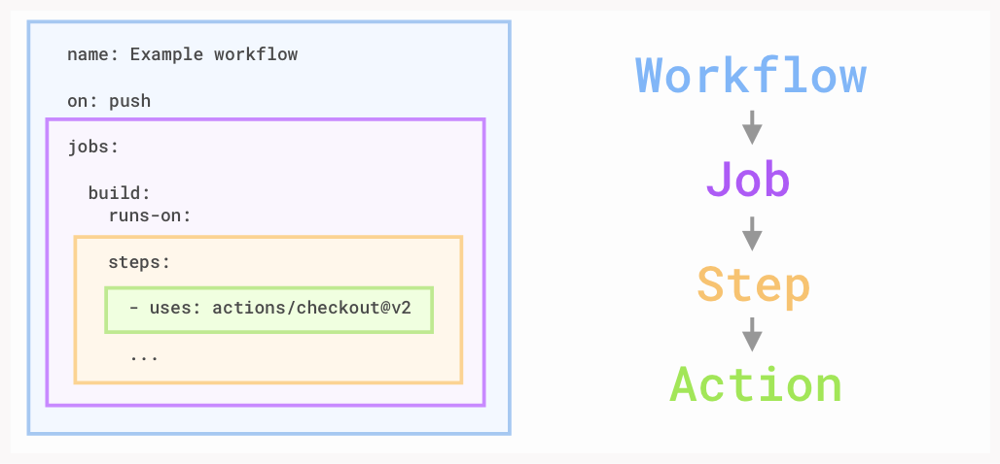

# Let's dig into the vocabulary of GitHub Actions.



### **Workflow**: A workflow is a unit of automation from start to finish, including the definition of what triggers the automation, what environment or other aspects should be taken account during the automation, and what should happen as a result of the trigger.   

### **Job**: A job is a section of the workflow, and is made up of one or more steps. In this section of our workflow, the template defines the steps that make up the build job.   

### **Step**: A step represents one effect of the automation. A step could be defined as a GitHub Action, or another unit, like printing something to the console.   

### **Action**: A GitHub Action is a piece of automation written in a way that is compatible with workflows. Actions can be written by GitHub, by the open source community, or you can write them yourself!

## What is checkout?
The power of GitHub Actions lies in access to actions written by the ✨ GitHub community. Here, we'll use two Actions officially written and supported by GitHub:

actions/checkout@v2 is used to ensure our virtual machine has a copy of our codebase. The checked out code will be used to run tests against.
actions/setup-node@v1 is used to set up proper versions of Node.js since we'll be performing testing against multiple versions.

---

## Node.js

In addition to running pre-built actions, the workflow can also execute commands, just as you would if you had direct access to the virtual machine. In this portion of the template workflow, we run some common commands relevant to Node.js projects, like npm install to install dependencies and npm test to run the chosen testing framework.  

To learn more about the fields discussed here, see:   

Workflow syntax for GitHub Actions: jobs.<job_id>.steps.run: on GitHub Help
```
npm install on the npm Documentation
npm run on the npm Documentation
npm test on the npm Documentation
```
---
## Some Markdown Tips
*[This is a link example](https://duckduckgo.com).*

<font color='red'>*This is Red italic.* text</font > <br />
<font color='green'>**This is Green Bold.** text</font > <br />
<span style="color:yellow">This is Yellow span text</span>

---
##  Add a step
Here's some tips to get you going:
 - the workflow file needs a steps: block
- give your new step any name you wish
- to use a community action, use the uses: keyword
- label-when-approved-action requires a block called env: with the following environment variables:
  - **APPROVALS** is the number of required approvals that are required for a label to be applied, please set this to "1"
  - **GITHUB_TOKEN** is necessary so the action can create and apply labels to this repository. See the action's documentation for how to use it
  - **ADD_LABEL** is the name of the label which should be added when the number of approvals have been met, choose any label name you wish

## PROTECTED BRANCHES
### How to 
- Go to `Branches settings`. You can navigate to that page manually by clicking on the right-most tab in the top of the repository called Settings and then clicking on Branches.
- Click on Add rule under "Branch protection rules".
- Type main in Branch name pattern.
- Check Require pull request reviews before merging.
- Check Require status checks to pass before merging.
- Check all build and test jobs that you'd like to see in the newly visible gray box.
- Click Create.
- Return to this pull request, and approve the requested review.